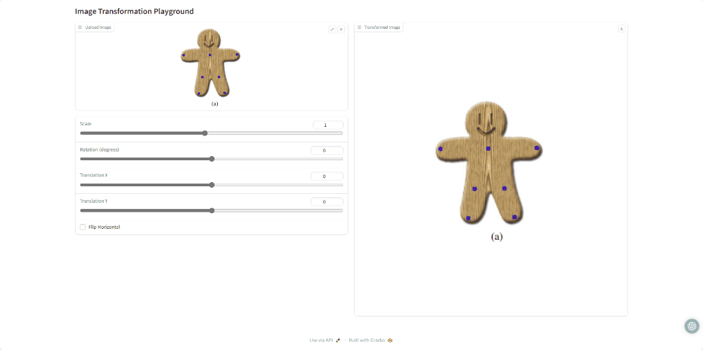
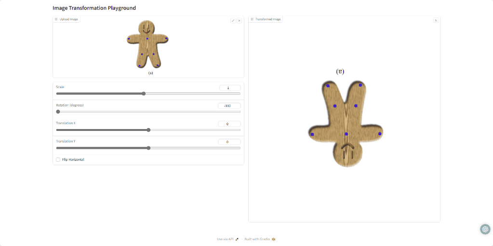
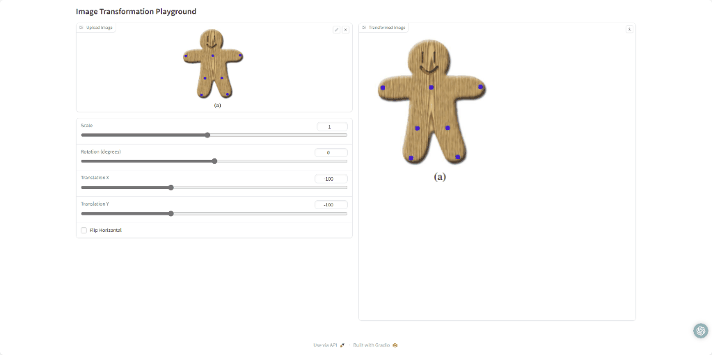
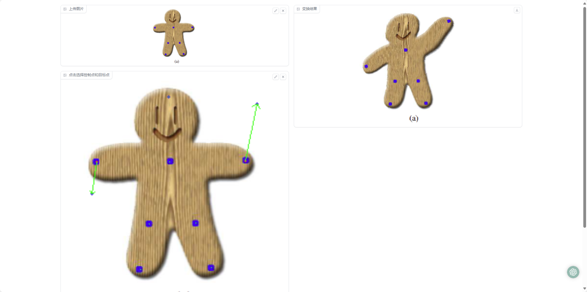
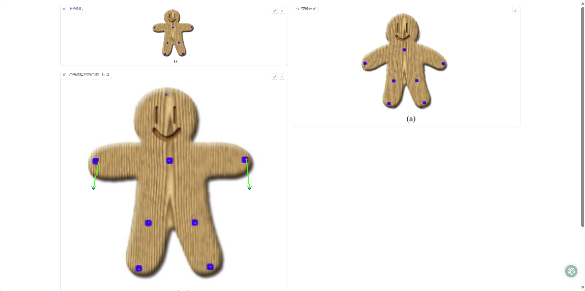

# Report for Assignment 1

## 功能描述
**该工程是SA24001048王鹏翔对DIP课程中的Assignment_01的实现，实现功能为对图片进行全局变换或者通过控制点实现图片变形**

## **运行环境**
**为了构建环境与安装所需依赖库，请执行一下命令:**

`git clone https://github.com/Yuzhibomingye/Homework_DIP.git`

`cd DIP/Assignments/01_ImageWarping`

`pip install -r requirements.txt`

## 程序运行

**为了实现基础的变形功能，请执行以下命令:**
`python run_global_transform.py`

**为了实现控制点变形功能，请执行以下命令:**
`python run_point_transform.py`

## 结果展示
### 全局变换结果展示
**1.scale**

**2.rotation**

**3.translation**

**4.flip**

### 控制点变形

## 实现方法
**本程序控制点变形实现方法的理论基础为[Image Deformation Using Moving Least Squares](https://people.engr.tamu.edu/schaefer/research/mls.pdf)中刚性变形的方法**
