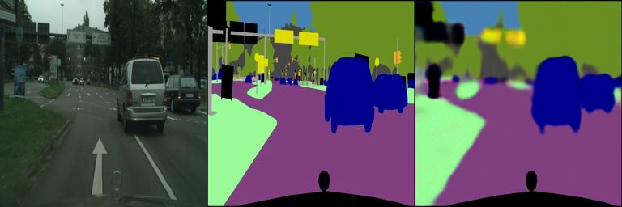
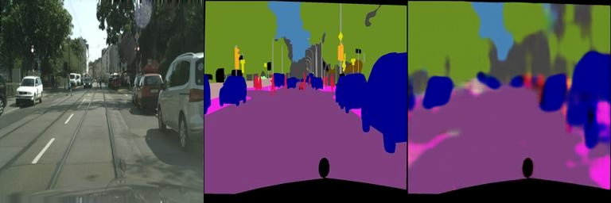
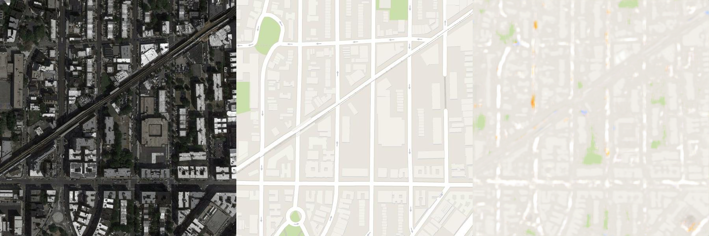
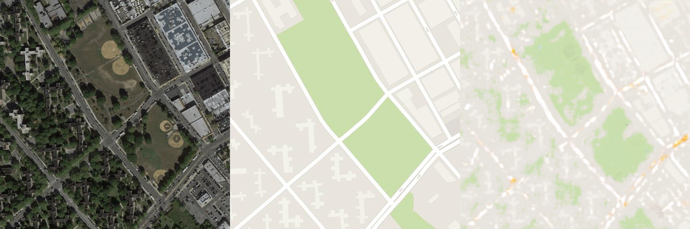

# Report for Assignment 2

## 功能描述
**该工程是SA24001048王鹏翔对DIP课程中的Assignment_02的实现，实现功能为利用机器学习实现图像的Possion融合与Pix2Pix的粗略实现。本报告仅介绍Pix2Pix**

## **运行环境**
**为了构建Possion融合境与安装所需依赖库，请执行以下命令:**

`git clone https://github.com/Yuzhibomingye/Homework_DIP.git`

`cd Homework_DIP/02_DIPwithPyTorch/Pix2Pix`

`pip install -r requirements.txt`

## 数据集准备

**为了能够正常运行程序，请执行以下命令进行数据集的下载与预处理:**

`bash download_facades_dataset.sh`

**其中bash download_facades_dataset.sh第一行的FILE为所选数据集种类，可以更改为其他类型的数据集，具体选择如下:**

- `facades`: 400 images from [CMP Facades dataset](http://cmp.felk.cvut.cz/~tylecr1/facade/). [[Citation](datasets/bibtex/facades.tex)]
- `cityscapes`: 2975 images from the [Cityscapes training set](https://www.cityscapes-dataset.com/).  [[Citation](datasets/bibtex/cityscapes.tex)]
- `maps`: 1096 training images scraped from Google Maps
- `edges2shoes`: 50k training images from [UT Zappos50K dataset](http://vision.cs.utexas.edu/projects/finegrained/utzap50k/). Edges are computed by [HED](https://github.com/s9xie/hed) edge detector + post-processing.[[Citation](datasets/bibtex/shoes.tex)]
- `edges2handbags`: 137K Amazon Handbag images from [iGAN project](https://github.com/junyanz/iGAN). Edges are computed by [HED](https://github.com/s9xie/hed) edge detector + post-processing.[[Citation](datasets/bibtex/handbags.tex)]
- `night2day`: around 20K natural scene images from  [Transient Attributes dataset](http://transattr.cs.brown.edu/) [[Citation](datasets/bibtex/transattr.tex)]. To train a `day2night` pix2pix model, you need to add `which_direction=BtoA`.

## 程序运行

**请执行以下命令进行训练与测试:**

`python train.py`

**程序每进行5伦训练就会将其在训练集与测试集上的结果保存在train_results和val_results中**

## 结果展示
**本次在不同实验数据集上进行了测试，以下为不同数据集最终的测试结果**

**1.city**

**2.maps**

