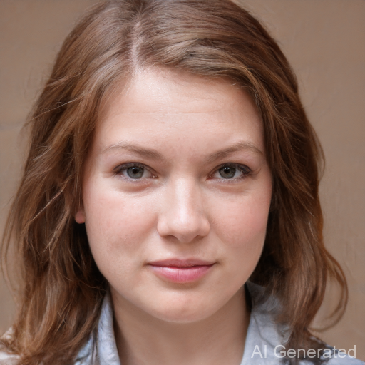
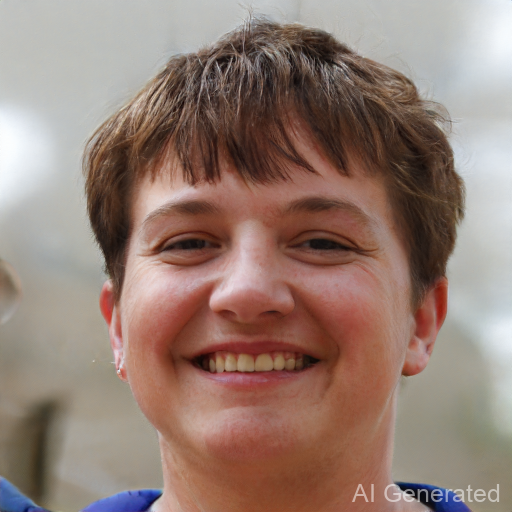
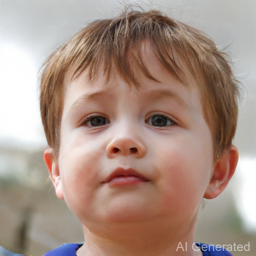
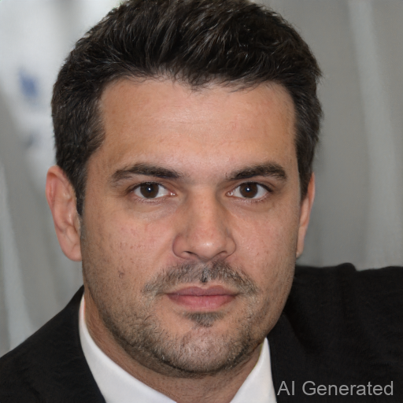
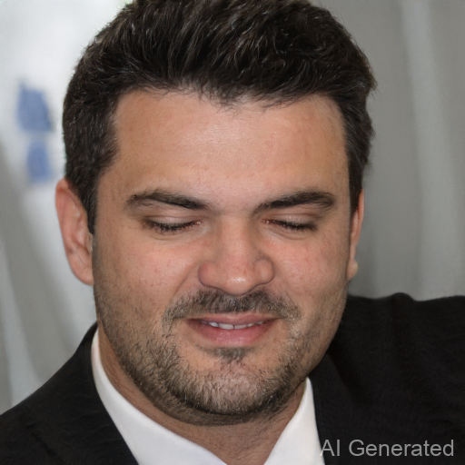

# Report for Assignment 3

## 功能描述
**该工程是SA24001048王鹏翔对DIP课程中的Assignment_03的实现，实现功能为DragGAN+face_alignment实现自动微笑，瘦脸，大眼，闭眼等操作**

## **运行环境**
**为了构建环境与安装所需依赖库，请执行以下命令:**

`git clone https://github.com/Yuzhibomingye/Homework_DIP.git`
`cd Homework_DIP/03_PlayWithGANs/DragGAN`
`conda env create -f environment.yml`
`conda activate stylegan3`
`pip install face_alignment`

## 程序运行

**请执行以下命令进行训练与测试:**

`python visualizer_drag_gradio.py`

**然后在对应的gradio界面进行编辑和生成即可**

## 结果展示
**本次在不同实验数据集上进行了测试，以下为最终的测试结果**

**1.微笑**

**2.瘦脸**

**3.大眼**

**4.闭眼**

