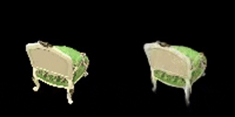

# Report for Assignment 4

## 功能描述
**该工程是SA24001048王鹏翔对DIP课程中的Assignment_04的实现，实现功能为简易的Gaussian_splatting**

## **运行环境**
**为了构建环境与安装所需依赖库，请执行以下命令:**

`git clone https://github.com/Yuzhibomingye/Homework_DIP.git`

`cd Homework_DIP/04_3DGS`

## 程序运行

**请执行以下命令进行训练与测试:**

`python mvs_with_colmap.py --data_dir PLACE_IMAGE`

`python train.py --colmap_dir PLACE_IMAGE --checkpoint_dir PLACE_IMAGE/checkpoints`

**将PLACE_IMAGE的部分换成对应图片所在路径即可。**

## 结果展示

**运行结果如下:**

**chair数据在175轮训练在36图片的视角下的结果:**

**最终生成的观察视频**

**lego数据在175轮训练在44图片的视角下的结果:**

**最终生成的观察视频**

